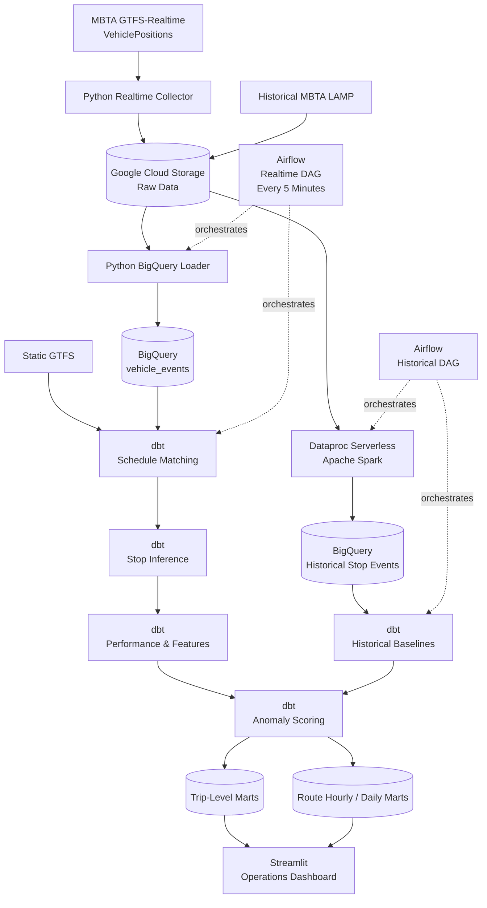
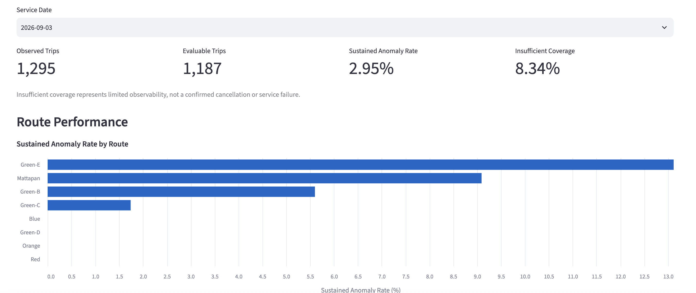
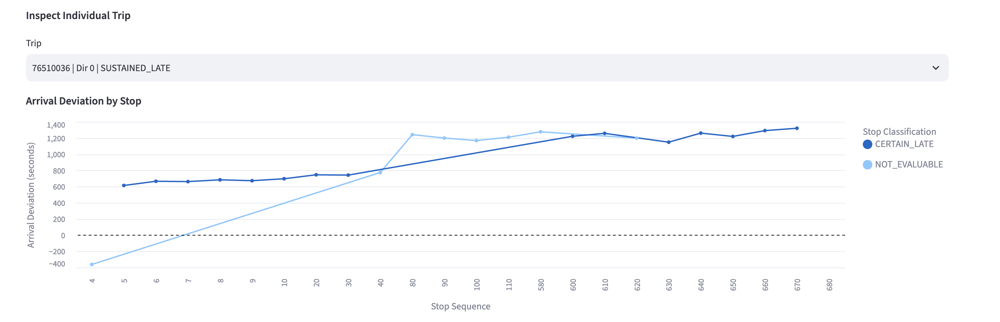

# MBTA Fleet Operations Data Platform

An end-to-end cloud data platform for analyzing MBTA fleet operations using realtime vehicle telemetry, scheduled GTFS service, and historical LAMP subway data.

The platform collects MBTA GTFS-Realtime VehiclePositions, preserves immutable raw snapshots in Google Cloud Storage, loads deduplicated vehicle events into BigQuery, transforms realtime and historical data with dbt and Spark, and produces stop-, trip-, and route-level operational metrics for a Streamlit dashboard.

## Key Results

- Processed **8.8M+ unique GTFS-Realtime vehicle events**
- Maintained **0 duplicate event keys** across manual reruns and scheduled Airflow executions
- Generated **~968K stop-level operational records**
- Achieved **94.35% historical-baseline coverage** across subway operations
- Completed the nine-model incremental dbt realtime branch in **~69 seconds**
- Removed **41.4% repeated snapshot observations** in a representative realtime ingestion benchmark

## Architecture



## Project Goals

The project was designed around practical data engineering problems:

- ingest frequently updating GTFS-Realtime vehicle data
- preserve raw data for reproducibility and backfills
- handle observations repeated across consecutive realtime snapshots
- make ingestion idempotent
- version and match realtime events against scheduled GTFS service
- infer stop arrival and departure behavior from noisy vehicle telemetry
- combine realtime observations with historical operating patterns
- generate anomaly and reliability metrics at operationally useful grains
- support incremental transformation as the dataset grows
- independently orchestrate realtime and historical workloads

## Technology Stack

| Layer | Technologies |
|---|---|
| Ingestion | Python, GTFS-Realtime Protocol Buffers |
| Orchestration | Apache Airflow 3 |
| Raw storage | Google Cloud Storage |
| Warehouse | BigQuery |
| Transformation | dbt, SQL |
| Historical processing | Apache Spark, Dataproc Serverless |
| Analytics | GTFS schedules, historical LAMP, IQR-based anomaly baselines |
| Presentation | Streamlit |

## Realtime Pipeline

The realtime collector polls the MBTA VehiclePositions feed approximately every five seconds.

```text
MBTA VehiclePositions
        |
        v
vehicle_positions_gcs.py
        |
        v
GCS raw protobuf snapshots
        |
        v
gcs_vehicle_events_to_bigquery.py
        |
        v
BigQuery vehicle_events
        |
        v
dbt realtime transformations
        |
        v
stop / trip / route marts
        |
        v
Streamlit dashboard
```

Raw protobuf snapshots remain immutable in GCS, allowing warehouse tables to be reconstructed without depending on the live MBTA endpoint.

Airflow orchestrates the realtime cloud pipeline every five minutes.

## Idempotent Realtime Ingestion

GTFS-Realtime feeds may repeat an unchanged logical vehicle observation across several consecutive snapshots.

Loading every snapshot row directly would therefore create duplicate warehouse events.

The platform creates a SHA-256 `event_key`.

When a vehicle timestamp is present:

```text
vehicle_id | vehicle_timestamp | trip_id
```

When it is unavailable:

```text
vehicle_id | feed_timestamp | trip_id | entity_id
```

The loader then applies two independent deduplication layers.

### Python deduplication

Before staging, rows are grouped by `event_key`.

If the same logical observation appears in multiple snapshots within one batch, the earliest ingestion observation is retained.

### BigQuery deduplication

The staging source independently applies:

```sql
ROW_NUMBER() OVER (
    PARTITION BY event_key
    ORDER BY
        ingestion_timestamp ASC,
        feed_timestamp ASC,
        entity_id ASC
)
```

Only `event_rank = 1` is presented to the target `MERGE`.

The final warehouse merge matches on:

```text
event_key
```

This makes overlapping loads and reruns idempotent.

### Validation

The live ingestion path was tested through:

- an initial clean warehouse baseline
- manual loader execution
- repeated manual execution
- two consecutive scheduled Airflow runs
- duplicate checks after each stage

Final result:

```text
duplicate event_keys = 0
```

At validation time, the warehouse contained approximately **8.8 million unique realtime vehicle events**.

A representative benchmark batch contained:

```text
Raw observations:             6,856
Unique event keys:            4,017
Repeated observations:        2,839
Repeated rows removed:        41.4%
```

The 41.4% figure describes that benchmark batch rather than a fixed source-wide deduplication rate.

## Scheduled GTFS Matching

Realtime vehicle events are matched against versioned scheduled GTFS service.

The matching layer incorporates:

- GTFS feed checksum
- service date
- trip ID
- stop sequence
- scheduled local time
- realtime event timing

The output provides the schedule context used by downstream stop inference and performance calculations.

## Stop Inference

VehiclePositions does not directly provide complete arrival and departure events for every scheduled stop.

The transformation layer therefore derives stop-level operational records from sequences of realtime observations.

Output includes:

- scheduled stop time
- inferred arrival bounds
- inferred departure bounds
- arrival and departure estimates
- observation counts
- observed vehicle counts
- arrival/departure uncertainty
- inference quality classification

The validated stop-event grain is:

```text
feed_checksum
service_date
trip_id
stop_sequence
stop_id
```

Validation found:

```text
duplicate rows at stop-event grain = 0
```

The current warehouse contains approximately **968K stop-level operational records**.

## Historical LAMP Pipeline

Historical MBTA LAMP subway data is processed separately from realtime ingestion.

```text
Historical LAMP
      |
      v
Google Cloud Storage
      |
      v
Dataproc Serverless Spark
      |
      v
BigQuery historical stop events
      |
      v
dbt historical transformations
      |
      v
historical stop baselines
```

Spark processes the historical source before normalized stop events are loaded into BigQuery.

Airflow orchestrates the historical pipeline independently of the five-minute realtime DAG.

## Historical Anomaly Baselines

Historical stop behavior is summarized using robust delay distributions.

Baseline statistics include:

- first quartile
- median
- third quartile
- interquartile range
- lower anomaly fence
- upper anomaly fence

Realtime stop performance is compared with the corresponding historical baseline.

Final classifications include:

```text
NORMAL
POSSIBLE_LATE
CERTAIN_LATE
NOT_EVALUABLE
```

Historical LAMP primarily supports subway operations.

Across:

```text
Red
Orange
Blue
Green-B
Green-C
Green-D
Green-E
Mattapan
```

approximately **94.35% of realtime subway stop events** had a usable historical baseline.

## dbt Transformation Layer

The warehouse transformation project follows staging, intermediate, and mart layers.

### Staging

```text
stg_vehicle_events
stg_vehicle_event_schedule_matches
stg_gtfs_trip_instances
stg_gtfs_stop_instances
stg_lamp_stop_events
```

### Intermediate

```text
int_vehicle_event_schedule_matches_cloud

int_realtime_stop_events
int_realtime_stop_performance
int_realtime_stop_features
int_realtime_stop_anomaly_scores

int_historical_stop_events
int_historical_stop_performance
int_historical_stop_features
int_historical_baseline_primary
int_historical_baseline_fallback
```

### Marts

```text
mart_realtime_trip_anomalies
mart_realtime_route_hourly
mart_realtime_route_daily

mart_historical_stop_baselines
mart_historical_route_hourly
mart_historical_route_daily
```

## Warehouse Scale

Recent validation produced approximately:

| Dataset | Rows |
|---|---:|
| Realtime vehicle events | **8.8M** |
| Realtime stop events | **968K** |
| Realtime stop performance | **968K** |
| Realtime stop features | **968K** |
| Realtime anomaly scores | **968K** |
| Realtime trip anomaly mart | **55K** |
| Realtime route-hourly mart | **22K** |
| Realtime route-daily mart | **2.4K** |

Counts continue to increase while realtime collection runs.

## Performance Benchmarks

### GCS to BigQuery Loader

Representative incremental batch:

```text
GCS snapshots:                  9
Raw vehicle observations:   6,856
Unique event keys:          4,017
Repeated observations:      2,839
Wall-clock runtime:         23.14 sec
```

Local CPU utilization represented only a small fraction of wall-clock runtime, indicating that the loader is primarily bounded by GCS, network, and BigQuery operations rather than local Python computation.

### Incremental dbt Realtime Branch

A nine-model incremental BigQuery transformation run completed in:

```text
dbt execution time: 66.04 sec
wall-clock time:    68.99 sec

PASS:   9
WARN:   0
ERROR:  0
```

The run included:

- schedule matching
- stop inference
- stop performance
- stop feature engineering
- anomaly scoring
- trip anomaly aggregation
- route-hourly aggregation
- route-daily aggregation

## Data Quality

The project includes dbt tests and standalone profiling utilities covering:

- vehicle-event uniqueness
- schedule-match uniqueness
- schedule-match validity
- stop-event uniqueness
- stop-event validity
- anomaly-score validity
- historical baseline validity
- historical baseline grain uniqueness
- historical route-mart uniqueness
- LAMP staging uniqueness
- vehicle-event schedule consistency

The full dbt test suite passes.

## Dashboard

The Streamlit dashboard queries BigQuery directly and does not require PostgreSQL.

It provides operational views for:

- route-level service reliability
- stop-level delay behavior
- anomaly classifications
- historical baseline comparisons
- service-date filtering
- subway route filtering
- individual trip inspection

### Operations Overview

The overview summarizes observed and evaluable service, sustained anomaly rates, coverage limitations, and route-level operational performance.



### Trip-Level Analysis

Individual trips can be inspected stop by stop to show how arrival deviation develops over the course of service and where historically abnormal delay behavior occurs.



Run locally with:

```bash
streamlit run src/dashboard/app_bigquery.py
```

## Airflow Orchestration

Two DAGs orchestrate the current cloud platform:

```text
mbta_realtime_cloud_pipeline
mbta_historical_cloud_pipeline
```

The realtime DAG runs every five minutes.

For local Airflow execution:

```bash
cd /Users/andrewlu/Desktop/mbta-fleet-operations

source .airflow-venv/bin/activate

export AIRFLOW_HOME="$PWD/.airflow"
export AIRFLOW__CORE__DAGS_FOLDER="$PWD/dags"

airflow standalone
```

The explicit DAG-folder configuration is required because this repository stores DAG definitions in the top-level `dags/` directory rather than inside `.airflow/dags`.

## Local Environments

The project keeps major runtimes separated to avoid conflicting dependencies.

### Cloud Python

```bash
python -m venv .venv
source .venv/bin/activate
pip install -r requirements.txt
```

### Airflow

```bash
python -m venv .airflow-venv
source .airflow-venv/bin/activate
pip install -r requirements-airflow.txt
```

### dbt

```bash
python -m venv .dbt-venv
source .dbt-venv/bin/activate
pip install -r requirements-dbt.txt
```

## Repository Structure

```text
mbta-fleet-operations/
│
├── dags/
│   ├── mbta_realtime_cloud_pipeline.py
│   └── mbta_historical_cloud_pipeline.py
│
├── dbt_mbta/
│   ├── models/
│   │   ├── staging/
│   │   ├── intermediate/
│   │   └── marts/
│   └── tests/
│
├── src/
│   ├── dashboard/
│   │   └── app_bigquery.py
│   │
│   ├── ingestion/
│   │   └── vehicle_positions_gcs.py
│   │
│   ├── loading/
│   │   ├── gcs_vehicle_events_to_bigquery.py
│   │   └── gtfs_stops_to_bigquery.py
│   │
│   ├── quality/
│   │   └── spark/
│   │
│   └── spark/
│       └── build_lamp_stop_events.py
│
├── docs/
│   ├── engineering_notes.md
│   └── images/
│       ├── dashboard_overview.png
│       └── dashboard_trip_analysis.png
│
├── legacy/
│   └── postgres/
│       ├── dags/
│       ├── src/
│       ├── sql/
│       ├── docker-compose.yml
│       └── requirements.txt
│
├── requirements.txt
├── requirements-airflow.txt
├── requirements-dbt.txt
└── README.md
```

## Legacy PostgreSQL Implementation

The project originally used a local PostgreSQL warehouse and Python/SQL transformation pipeline.

That implementation is preserved under:

```text
legacy/postgres/
```

It includes earlier work on:

- local realtime ingestion
- PostgreSQL indexing
- incremental SQL transformations
- historical backfills
- Parquet exports
- local Streamlit analytics
- pipeline runtime optimization

The production-style architecture was later migrated to:

```text
GCS
BigQuery
dbt
Dataproc Serverless
Spark
Airflow
Streamlit
```

The PostgreSQL implementation is retained to document the engineering evolution of the project but is not required by either current cloud pipeline.

## Engineering Decisions

The project intentionally avoids adding infrastructure solely for technology breadth.

Each major tool addresses a concrete requirement:

| Technology | Problem addressed |
|---|---|
| GCS | Immutable raw storage, replayability, backfills |
| BigQuery | Scalable analytical warehouse |
| dbt | Structured transformations, incremental models, testing |
| Spark | Historical LAMP processing |
| Airflow | Realtime and historical workflow orchestration |
| Streamlit | Operational analytics presentation |

The architecture evolved in response to measured scalability, reliability, and maintainability requirements rather than as a collection of disconnected technologies.